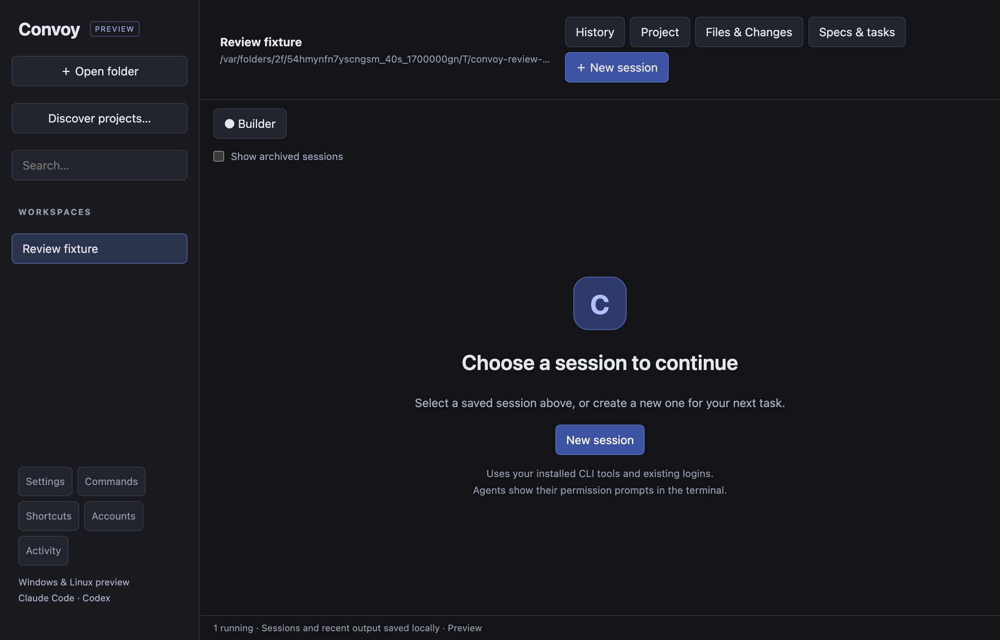
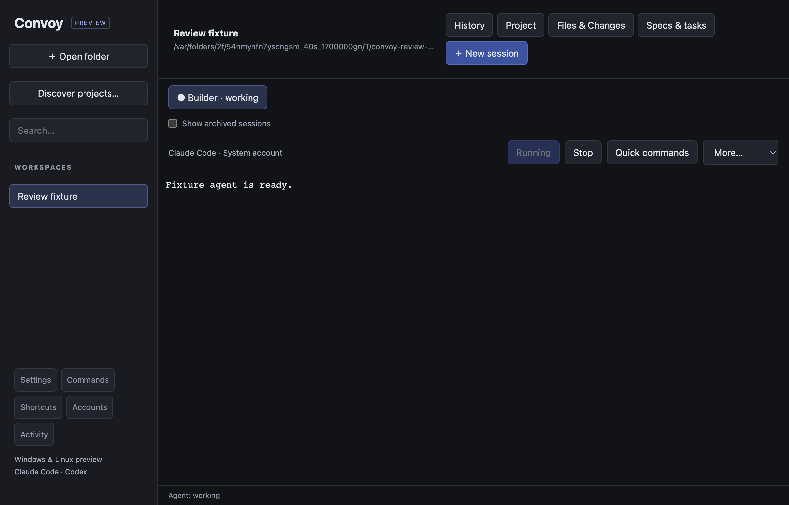
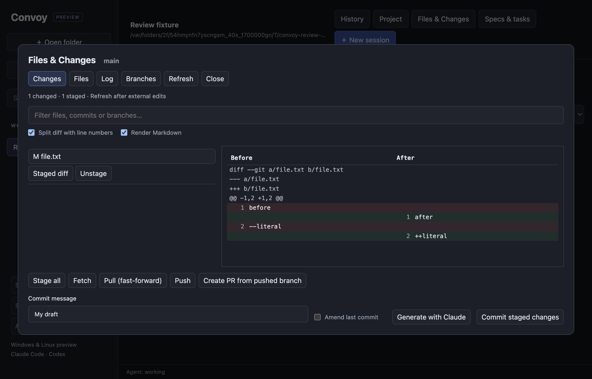
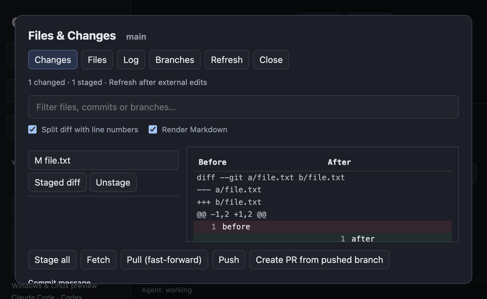

# Convoy code and interface review — 24 September 2026

Reviewed the Electron renderer, terminal lifecycle, Files & Changes IPC and Git helpers, and the native macOS Git panel's selected-diff handling. This is a focused correctness and usability review, not an exhaustive security or accessibility certification. Screenshots use the current Electron build with temporary fixture data; no provider request or customer data is involved.

## Fixed findings

| Priority | Problem | Fix and evidence |
| --- | --- | --- |
| High | Opening a repository subfolder mixed root-relative status paths with subfolder-relative file lists and commands. Previews could fail and actions could address the wrong path. | Resolve the repository root for snapshots, previews and mutations, including the main-process mutation lock and Trash path. A real Git regression failed before the fix and now exercises preview, stage, unstage and discard from a subfolder. |
| Medium | Files & Changes shared one request counter for refreshes and previews. Reading a file during a slow refresh could silently discard the refresh. | Separate snapshot and preview generations. The renderer regression deliberately holds a refresh while selecting a file and verifies that both results arrive. |
| Medium | Staged-only rows opened an empty unstaged diff, and a selected preview stayed stale after staging. Native macOS also retained an unavailable unstaged selection. | Choose the available diff and reconcile it after refresh. Covered by desktop renderer tests and native GitPanelModel integration tests. |
| Medium | A late generated commit message could overwrite a reopened dialog with the same repository and draft. | Bind asynchronous UI results to the dialog lifetime, preserve drafts before reopening, and ignore deferred close events while the dialog is open. Linux CI exposed the delayed-close case. Regression tests resolve generation and file reads after rapid closing and reopening. |
| Medium | Removed projects retained xterm instances, DOM nodes and cached state. | Dispose removed sessions' terminal instances and ignore queued output for those sessions. Verified by removing the project and delivering late output. |
| Medium | Every status render reassigned terminal options and sent redundant PTY resize requests. | Cache applied settings, coalesce layout work per animation frame and send sizes only when they change or a PTY resumes. Ten status events produce no additional resize messages; resume still sends the correct dimensions. |
| Medium | Split diffs interpreted content beginning with `---` or `+++` as file headers. | Parse line prefixes inside hunk context; regression checks verify these remain removed/added content. |
| Low | Git operations provided no progress feedback, and repeated clicks caused competing operations. | Show operation status, announce it with a live region and disable mutation buttons while busy. |
| Low | The empty workspace still asked users to open a project after they had opened one. A running agent showed a disabled Resume button. | Add project-aware next steps and an explicit Running label. Disable project-only actions before a folder is selected. |
| Low | Git tabs lacked visual selection, branch creation cluttered the Changes tab, and split diffs lacked side labels. Queue button text could become stale after background updates. | Highlight selected tabs, show forms in their relevant tabs, label Before/After, improve borders and light-theme secondary text, and derive queue text from current state. |

## Reviewed flow

### 1. Open a project / choose a session — improved

The workspace now distinguishes a missing project, a project without sessions and a project with saved sessions. It offers a relevant next action. Existing project navigation and explicit session creation are retained.

### 2. Use the selected agent terminal — healthy in the tested flow

The selected agent and running state are visible. Status updates no longer repeatedly resize the same terminal, and removed projects release their terminal instances. Starting a real provider still requires its installed CLI and login; this capture uses harmless fixture output.

### 3. Review and stage changes — improved

The selected tab, staged count and Before/After columns make the review context clearer. Staging follows the same file into its staged diff. Slow refreshes and late dialog responses are covered by deterministic tests. Actual Git mutations are separately exercised in temporary repositories.

### 4. Review at the minimum window size — usable with scrolling

At 760 × 500, the dialog stays inside the window without horizontal overflow. The preview and dialog scroll independently; commit controls require vertical scrolling. A future docked panel or compact toolbar could reduce this friction.

## Verification and limits

- Desktop unit suite: 36 passed; one Windows-only test skipped locally.
- Existing renderer smoke test and new review regression test passed.
- PTY smoke test and real application IPC/lifecycle test passed with harmless fixtures.
- Native Git panel suite: seven tests passed, including the added selected-diff assertion.
- Screenshots inspected at normal and minimum window sizes; existing smoke tests also exercise light mode and split terminals.
- Screen readers, OS notification permission prompts and real provider authentication were not manually audited. Visible labels and live-region semantics are improvements, not proof of full accessibility compliance.
- External Git edits still require Refresh in the preview app. This behavior is now stated beside the change count.
- The native macOS review was code and integration-test based; these screenshots are of the Electron app.

## Suggested next features

1. **Setup diagnostics.** Check Git, Claude/Codex CLI availability, account selection and folder access before Start, with a precise recovery action for each failure. Never display credentials or start paid provider work during the check.
2. **Attention inbox.** Collect agents waiting for input, failed tasks and completed turns across projects. Each item should jump directly to its session; acceptance remains explicit.
3. **Review tied to a revision.** Record the commit and worktree diff fingerprint when a review begins. Show whether findings still apply after further edits, and offer to rerun the review when they become stale.
4. **Saved workspace layouts.** Restore selected projects, split panes and font settings on reopen, with explicit Resume buttons rather than automatically restarting agents.

I would start with setup diagnostics: it addresses the first failure users encounter when trying the new Windows/Linux builds.
